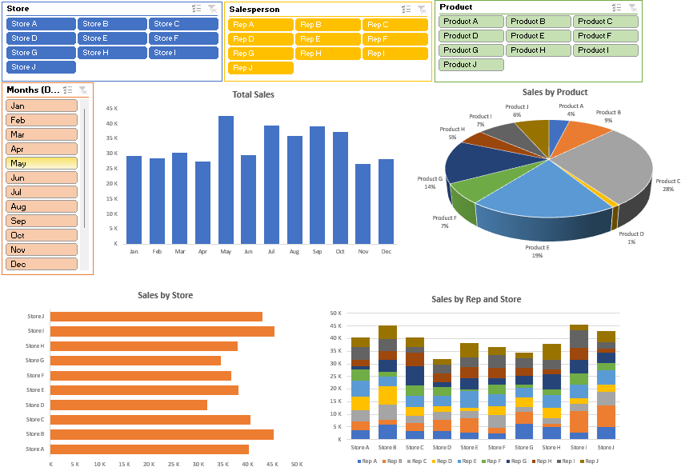

# Basic Sales Dashboard – Excel

This dashboard presents a simple sales overview using sample data from 2017. It was built in Microsoft Excel using pivot charts and slicers.

### Key Insights
- Total sales performance
- Sales breakdown by product, store, and salesperson
- Store-wise salesperson contribution

### Interactive Filters
- Store  
- Salesperson  
- Product  
- Month

### Techniques Used
- Pivot Tables & Charts  
- Excel Slicers  
- Basic data cleaning  
- Dashboard layout formatting

### How to Use
- Open the Excel file in Microsoft Excel (desktop version recommended)
- Use slicers to explore sales by different segments
- All visuals update based on selection

### File
- `Basic_Sales_Dashboard_Project1.xlsx` – includes raw data, pivots, and dashboard

### Reference
Inspired by HowtoExcel.net's tutorial: [YouTube Video](https://www.youtube.com/watch?v=JcdORXZjbbg)

### Note
For personal learning and portfolio display only.
